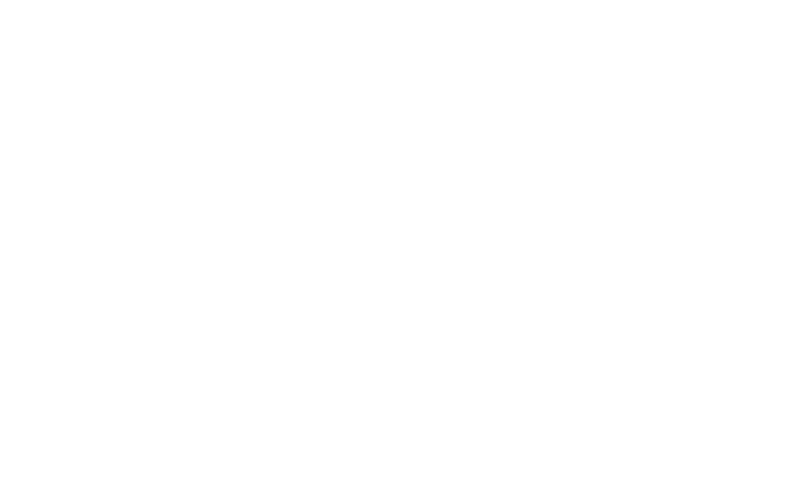

# 🚀 VAE Systems Website - Modern Rebuild

<div align="center">
  
  
  **Enterprise-grade KI-Lösungen für maximale Effizienz und Datensouveränität**
  
  [](https://reactjs.org/)
  [](https://www.typescriptlang.org/)
  [](https://vitejs.dev/)
  [](https://tailwindcss.com/)
</div>

## ✨ Features

### 🎨 **Modern Design System**
- **Design Tokens** – Farbschemata, Typografie & Spacing zentral in `src/design-system`
- **VAE Corporate Identity** – Authentisches Türkis (`#00ffa5`) als Primary
- **Glassmorphism Effects** – Moderne translucent UI Elemente
- **Responsive Design** – Mobile-first für alle Viewports
- **Dual Theme** – Light & Dark Mode mit robustem Theme Manager

### 🏗️ **Technical Architecture**
- **React 18** - Latest React with concurrent features
- **TypeScript** - Strict type safety and better DX
- **Vite** - Lightning-fast build tool and dev server
- **Tailwind CSS** - Utility-first CSS framework
- **Material Symbols** - Google's latest icon system
- **Framer Motion** - Smooth animations and transitions
- **GSAP** - Professional-grade animation library

### 📱 **Components & Sections**

#### 🎯 **Hero Section**
- Typewriter effect with VAE branding
- Network visualization with animated connections
- Professional trust indicators
- Direct contact integration

#### 🛠️ **Services Portfolio**
1. **Open Source Consulting** - Transparente Lösungen ohne Vendor-Lock-ins
2. **Setup & Training** - Umfassende Implementierung und Schulungen
3. **Startup Tech Stack** - Kosteneffiziente, skalierbare Infrastruktur
4. **KI-Beratung & Integration** - Lokale AI-Modelle und Workflow-Engines
5. **Local Hosting Solutions** - Container-Orchestrierung mit Docker/Kubernetes
6. **VAEKTRA CORE Enterprise** - All-in-One Enterprise-Lösung (Coming Q1 2026)

## 🚀 Quick Start

### Prerequisites
- Node.js 18+ 
- npm or yarn

### Installation

```bash
# Clone the repository
git clone https://github.com/YOUR_USERNAME/vae-web-project.git
cd vae-web-project

# Install dependencies
npm install

# Start development server
npm run dev
```

### Available Scripts

```bash
npm run dev          # Start development server (http://localhost:5173)
npm run build        # Build for production
npm run preview      # Preview production build
npm run lint         # Run ESLint
```

## 📁 Project Structure

```
vae-web-project/
├── 📁 public/                  # Static assets
│   ├── LOGO_01_white.svg      # VAE logo variants
│   ├── LOGO_02.svg
│   └── logo.svg
├── 📁 src/
│   ├── 📄 App.tsx               # Haupt-App inkl. Routing & ThemeProvider
│   ├── 📄 main.tsx              # Entry-Point (ReactDOM.createRoot)
│   ├── 📁 components/
│   │   ├── 📁 layout/           # Header, Footer, globale Navigation
│   │   ├── 📁 pages/            # Page-Container (Routing Targets)
│   │   ├── 📁 sections/         # Inhaltliche Sektionen (Hero, Services, ...)
│   │   └── 📁 ui/               # Wiederverwendbare UI-Bausteine
│   │       └── 📁 buttons/      # Interaktive Buttons (z. B. MagneticButton)
│   ├── 📁 design-system/        # Tokens, ThemeManager & Typografie-Helfer
│   ├── 📁 contexts/             # React Contexts (ThemeContext, ...)
│   ├── 📁 hooks/                # Wiederverwendbare Hooks (Animation, Scroll ...)
│   └── 📁 styles/               # Globale Styles, Animationen & Theme-CSS
├── 📄 tailwind.config.js       # Tailwind configuration
├── 📄 vite.config.ts          # Vite build configuration
└── 📄 tsconfig.json           # TypeScript configuration
```

## 🎨 Design System

### Theme & Tokens

Alle Designparameter leben in `src/design-system`:

- `tokens.ts` – Light/Dark Themes (Farben, Spacing, Radii, Schatten, Transitions)
- `themeManager.ts` – Wendet Tokens auf den DOM an & synchronisiert `data-theme-mode`
- `typography.ts` – Helfer um Typografiestile (`getTypographyStyle`) konsistent zu nutzen

**Nutzung im Code**

```tsx
import { MagneticButton } from '@/components/ui'
import { getTypographyStyle } from '@design-system/typography'

<MagneticButton textStyle="headline" glowEffect>
  Jetzt starten
</MagneticButton>

const headlineStyles = getTypographyStyle('headline')
```

**Farben** werden als CSS-Custom-Properties zur Verfügung gestellt (`--ds-color-*`).
Bestehende Legacy-Variablen (`--theme-*`) bleiben für Abwärtskompatibilität erhalten.

## 📞 Contact

**VAE Systems**
- Email: info@vae.systems
- Website: [vae.systems](https://vae.systems)

---

<div align="center">
  <p><strong>Built with ❤️ by VAE Systems</strong></p>
  <p><em>VERSATILE AI/ENHANCED/SYSTEMS_</em></p>
</div>
