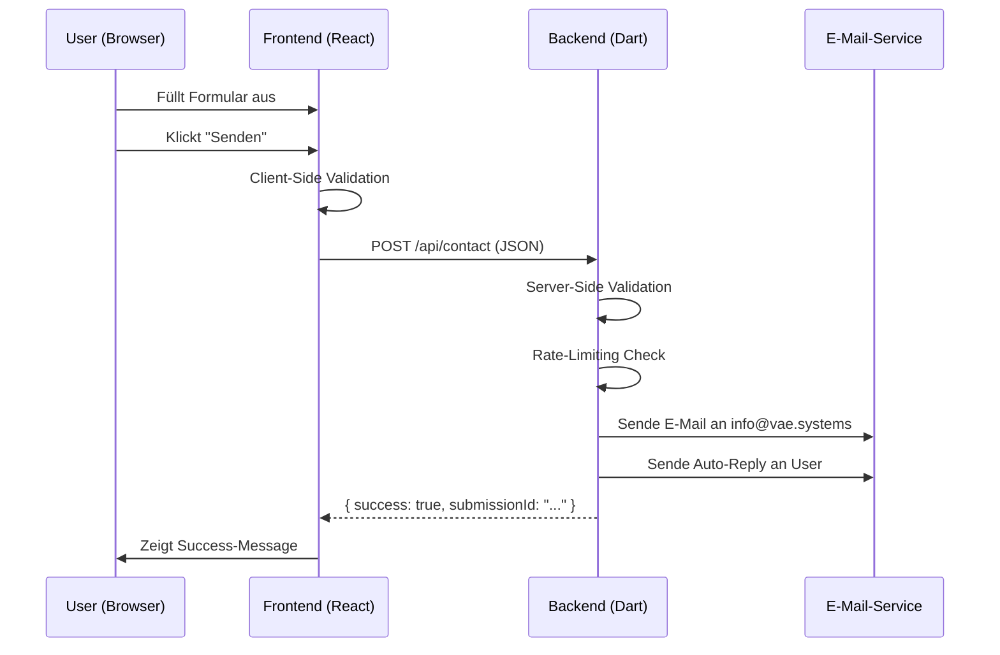

# E-Mail-Backend-Integration – Requirements für Backend-Developer

**Erstellt:** 7. Januar 2026  
**Zielgruppe:** Jakob (Backend-Developer, Dart)  
**Frontend-Owner:** Julian  
**Projekt:** vae.systems Website

---

## 📋 EXECUTIVE SUMMARY

Die VAE Systems Website nutzt aktuell `mailto:`-Links, um Kontaktanfragen zu versenden. Diese Lösung soll durch ein Backend-gestütztes E-Mail-System ersetzt werden, das Formulardaten per POST-Request entgegennimmt und E-Mails versendet.

**Ziel:** Professionelles, DSGVO-konformes E-Mail-Handling mit Rate-Limiting, Validierung und Auto-Reply-Funktionalität.

---

## 1. IST-ZUSTAND (Current State)

### 1.1 Betroffene Komponenten & Use Cases

Aktuell gibt es **3 Hauptszenarien**, in denen E-Mails versendet werden:

| **Use Case**                               | **Datei(en)**                                                            | **Beschreibung**                                                                                                | **Aktuelles Verhalten**                            |
| ------------------------------------------ | ------------------------------------------------------------------------ | --------------------------------------------------------------------------------------------------------------- | -------------------------------------------------- |
| **1. Contact Page – Mail Builder**         | `src/components/pages/ContactPage.tsx` (Zeile 358, 936)                  | User füllt 3-Schritte-Formular aus (Thema, Timeline, Setup) → generiert vorformulierte E-Mail                   | `mailto:` öffnet Mail-Client mit vorbefülltem Text |
| **2. Setup Page – Sparpotenzial anfragen** | `src/components/pages/SetupPage.tsx` (Zeile 464)                         | User berechnet SaaS-Kosten → klickt "Sparpotenzial anfordern"                                                   | `mailto:` öffnet Mail-Client mit Kalkulationsdaten |
| **3. General Contact Form**                | `src/components/forms/ContactForm.tsx`, `src/services/contactService.ts` | Standard-Kontaktformular (Name, E-Mail, Message) – aktuell **deaktiviert** (siehe `contactService.ts` Zeile 72) | Mock-API, kein echter Versand                      |

### 1.2 Aktueller Code-Flow (Beispiel: ContactPage)

```tsx
// ContactPage.tsx - Zeile 358
const handlePrepareEmail = () => {
  // Validation
  const missingFields: string[] = []
  if (!contactName.trim()) missingFields.push('Name')
  if (!companyName.trim()) missingFields.push('Unternehmen')

  if (missingFields.length > 0) {
    setValidationError(`Bitte folgende Pflichtfelder ausfüllen: ${missingFields.join(', ')}`)
    return
  }

  // Generate mailto: link
  const subject = 'Kontakt VAE Systems | ...'
  const mailto = `mailto:info@vae.systems?subject=${encodeURIComponent(subject)}&body=${encodeURIComponent(mailPreview)}`
  window.location.href = mailto // ← Öffnet Mail-Client
}
```

**Probleme mit aktuellem Ansatz:**

- User muss Mail-Client konfiguriert haben
- Keine Garantie, dass E-Mail wirklich versendet wird
- Keine Backend-Logging oder Tracking
- Kein Spam-Schutz
- Keine Auto-Reply möglich

---

## 2. SOLL-ZUSTAND (Target State)

### 2.1 Neuer Flow



### 2.2 User Experience – Änderungen

| **Vorher (mailto:)**                      | **Nachher (Backend-Logik)**                       |
| ----------------------------------------- | ------------------------------------------------- |
| Popup: "Öffnet sich Mail-Client..."       | Popup: "E-Mail wird versendet..." (Loading-State) |
| User muss manuell senden                  | Backend versendet automatisch                     |
| Keine Bestätigung                         | Success-Message + Auto-Reply-E-Mail               |
| Keine Eingabefelder für User-Kontaktdaten | **Neu:** E-Mail-Feld im Formular (für Auto-Reply) |

---

## 3. BACKEND-REQUIREMENTS (für Jakob)

### 3.1 API-Endpoint: `POST /api/contact`

**URL:** `https://vae.systems/api/contact`  
**Method:** `POST`  
**Content-Type:** `application/json`

#### Request-Schema

```typescript
{
  // ── PFLICHTFELDER ──
  "name": string,           // Min 2 Zeichen, Max 100 Zeichen
  "email": string,          // Valide E-Mail-Adresse (Regex-Check)
  "message": string,        // Min 10 Zeichen, Max 2000 Zeichen

  // ── OPTIONALE FELDER ──
  "company"?: string,       // Max 100 Zeichen
  "phone"?: string,         // Regex: /^[\+]?[\d\s\-\(\)]{7,}$/
  "subject"?: string,       // Max 200 Zeichen

  // ── KONTEXT-METADATEN ──
  "source": string,         // "mail-builder" | "setup-page" | "contact-form"
  "intent"?: string,        // "automation" | "infrastructure" | "product" | "advisory"
  "timeline"?: string,      // "now" | "soon" | "later"
  "companyStage"?: string,  // "scaleup" | "sme" | "greenfield"
  "collabMode"?: string,    // "project" | "retainer" | "sparring"

  // ── ZUSATZDATEN (Setup-Page) ──
  "calculationData"?: {
    "monthlySaaSCost": number,
    "estimatedSetupCost": number,
    "yearOneSavings": number,
    "toolSelection": string[]
  },

  // ── TECHNISCHE FELDER ──
  "timestamp": string,      // ISO 8601 Format
  "clientVersion"?: string, // Frontend-Version (für Debugging)
  "locale"?: string         // "de-DE" (für zukünftige Mehrsprachigkeit)
}
```

#### Response-Schema

**Success (HTTP 200):**

```json
{
  "success": true,
  "data": {
    "submissionId": "contact_1704627340123_abc123def",
    "confirmationSent": true,
    "estimatedResponse": "24-48 Stunden"
  },
  "timestamp": "2026-01-07T14:30:00.000Z"
}
```

**Error (HTTP 400 - Validation Error):**

```json
{
  "success": false,
  "error": {
    "code": "VALIDATION_ERROR",
    "message": "Validierungsfehler",
    "details": [
      { "field": "email", "message": "Ungültige E-Mail-Adresse", "code": "INVALID_EMAIL" },
      { "field": "message", "message": "Nachricht muss mindestens 10 Zeichen lang sein", "code": "MESSAGE_TOO_SHORT" }
    ]
  },
  "timestamp": "2026-01-07T14:30:00.000Z"
}
```

**Error (HTTP 429 - Rate Limit):**

```json
{
  "success": false,
  "error": {
    "code": "RATE_LIMIT_EXCEEDED",
    "message": "Zu viele Anfragen. Bitte versuchen Sie es in 15 Minuten erneut.",
    "retryAfter": 900
  },
  "timestamp": "2026-01-07T14:30:00.000Z"
}
```

**Error (HTTP 500 - Server Error):**

```json
{
  "success": false,
  "error": {
    "code": "SUBMISSION_ERROR",
    "message": "Interner Serverfehler. Bitte versuchen Sie es später erneut.",
    "details": "Error sending email: SMTP timeout"
  },
  "timestamp": "2026-01-07T14:30:00.000Z"
}
```

---

### 3.2 Validierungsregeln (Server-Side)

| **Feld**  | **Regel**                                                  | **Error-Code**                                              |
| --------- | ---------------------------------------------------------- | ----------------------------------------------------------- |
| `name`    | Required, 2-100 Zeichen                                    | `NAME_REQUIRED`, `NAME_TOO_SHORT`, `NAME_TOO_LONG`          |
| `email`   | Required, Regex: `/^[^\s@]+@[^\s@]+\.[^\s@]+$/`            | `EMAIL_REQUIRED`, `EMAIL_INVALID`                           |
| `message` | Required, 10-2000 Zeichen                                  | `MESSAGE_REQUIRED`, `MESSAGE_TOO_SHORT`, `MESSAGE_TOO_LONG` |
| `phone`   | Optional, wenn gesetzt: Regex: `/^[\+]?[\d\s\-\(\)]{7,}$/` | `PHONE_INVALID`                                             |
| `company` | Optional, Max 100 Zeichen                                  | `COMPANY_TOO_LONG`                                          |
| `subject` | Optional, Max 200 Zeichen                                  | `SUBJECT_TOO_LONG`                                          |

**Zusätzliche Checks:**

- **Spam-Erkennung:** Blocke Anfragen mit verdächtigen Patterns (z.B. 100x gleicher Text, URLs in `message` > 5)
- **XSS-Schutz:** Sanitize alle String-Felder (escape HTML-Tags)
- **Rate-Limiting:** Max. 3 Anfragen pro IP-Adresse innerhalb von 15 Minuten

---

### 3.3 E-Mail-Versand-Logik

#### 3.3.1 E-Mail an VAE Systems (`info@vae.systems`)

**Betreff:**

```
Kontaktanfrage: [source] | [intent] | [company]

Beispiel:
"Kontaktanfrage: Mail Builder | KI-Automatisierung | Beispiel GmbH"
```

**Body (HTML + Plain Text):**

```html
<!DOCTYPE html>
<html>
  <body style="font-family: sans-serif; max-width: 600px; margin: 0 auto;">
    <h2>Neue Kontaktanfrage von vae.systems</h2>

    <table style="width: 100%; border-collapse: collapse;">
      <tr>
        <td style="padding: 8px; background: #f5f5f5;"><strong>Name:</strong></td>
        <td style="padding: 8px;">{name}</td>
      </tr>
      <tr>
        <td style="padding: 8px; background: #f5f5f5;"><strong>E-Mail:</strong></td>
        <td style="padding: 8px;"><a href="mailto:{email}">{email}</a></td>
      </tr>
      <tr>
        <td style="padding: 8px; background: #f5f5f5;"><strong>Unternehmen:</strong></td>
        <td style="padding: 8px;">{company || "-"}</td>
      </tr>
      <tr>
        <td style="padding: 8px; background: #f5f5f5;"><strong>Telefon:</strong></td>
        <td style="padding: 8px;">{phone || "-"}</td>
      </tr>
    </table>

    <h3>Nachricht:</h3>
    <div style="background: #f9f9f9; padding: 16px; border-left: 4px solid #08ffc1;">{message}</div>

    {#if intent || timeline || companyStage || collabMode}
    <h3>Kontext:</h3>
    <ul>
      {#if intent}
      <li><strong>Interesse:</strong> {intent}</li>
      {/if} {#if timeline}
      <li><strong>Timeline:</strong> {timeline}</li>
      {/if} {#if companyStage}
      <li><strong>Setup:</strong> {companyStage}</li>
      {/if} {#if collabMode}
      <li><strong>Zusammenarbeit:</strong> {collabMode}</li>
      {/if}
    </ul>
    {/if} {#if calculationData}
    <h3>Kalkulationsdaten (Setup-Page):</h3>
    <ul>
      <li><strong>Monatliche SaaS-Kosten:</strong> {calculationData.monthlySaaSCost}€</li>
      <li><strong>Geschätzter Setup-Aufwand:</strong> {calculationData.estimatedSetupCost}€</li>
      <li><strong>Einsparung Jahr 1:</strong> {calculationData.yearOneSavings}€</li>
      <li><strong>Tools:</strong> {calculationData.toolSelection.join(', ')}</li>
    </ul>
    {/if}

    <hr style="margin: 24px 0;" />
    <p style="color: #666; font-size: 12px;">
      Quelle: {source}<br />
      Zeitstempel: {timestamp}<br />
      Submission-ID: {submissionId}
    </p>
  </body>
</html>
```

**Plain-Text-Fallback:**

```
Neue Kontaktanfrage von vae.systems
────────────────────────────────────

Name: {name}
E-Mail: {email}
Unternehmen: {company || "-"}
Telefon: {phone || "-"}

Nachricht:
{message}

[Kontext- und Kalkulationsdaten wie oben]

────────────────────────────────────
Quelle: {source}
Zeitstempel: {timestamp}
Submission-ID: {submissionId}
```

#### 3.3.2 Auto-Reply an User (`{email}`)

**Betreff:**

```
Ihre Anfrage bei VAE Systems – wir melden uns innerhalb von 24-48h
```

**Body (HTML):**

```html
<!DOCTYPE html>
<html>
  <body style="font-family: sans-serif; max-width: 600px; margin: 0 auto; padding: 20px;">
    <div style="text-align: center; margin-bottom: 32px;">
      
    </div>

    <h2 style="color: #08ffc1;">Vielen Dank für Ihre Anfrage, {name}!</h2>

    <p>
      Ihre Nachricht ist bei uns eingegangen. Wir melden uns innerhalb von <strong>24-48 Stunden</strong> bei Ihnen.
    </p>

    <div style="background: #f2fff8; padding: 16px; border-left: 4px solid #08ffc1; margin: 24px 0;">
      <p style="margin: 0;"><strong>Ihre Anfrage im Überblick:</strong></p>
      <ul style="margin: 8px 0;">
        {#if intent}
        <li>Interesse: {intent}</li>
        {/if} {#if timeline}
        <li>Timeline: {timeline}</li>
        {/if} {#if subject}
        <li>Betreff: {subject}</li>
        {/if}
      </ul>
    </div>

    <p>In der Zwischenzeit können Sie gerne:</p>
    <ul>
      <li><a href="https://vae.systems/ressourcen/faq" style="color: #08ffc1;">Unsere FAQ durchstöbern</a></li>
      <li><a href="https://vae.systems/about" style="color: #08ffc1;">Mehr über uns erfahren</a></li>
    </ul>

    <hr style="margin: 32px 0; border: none; border-top: 1px solid #e0e0e0;" />

    <p style="color: #666; font-size: 12px;">
      VAE Systems – Automatisierung & Infrastruktur<br />
      Heidelberg / Mannheim / Rhein-Neckar<br />
      E-Mail: <a href="mailto:info@vae.systems" style="color: #08ffc1;">info@vae.systems</a><br />
      Web: <a href="https://vae.systems" style="color: #08ffc1;">vae.systems</a>
    </p>

    <p style="color: #999; font-size: 10px; margin-top: 24px;">Referenz-ID: {submissionId}</p>
  </body>
</html>
```

---

### 3.4 E-Mail-Provider-Empfehlungen

| **Provider**       | **Vorteile**                             | **Nachteile**                | **Empfehlung** |
| ------------------ | ---------------------------------------- | ---------------------------- | -------------- |
| **Resend**         | Modern, einfache API, gutes Dart-Package | Relativ neu                  | ⭐⭐⭐⭐⭐     |
| **SendGrid**       | Etabliert, großes Feature-Set, Analytics | Komplexer Setup              | ⭐⭐⭐⭐       |
| **Postmark**       | Spezialisiert auf Transactional-Mails    | Teurer                       | ⭐⭐⭐         |
| **SMTP (Hetzner)** | Volle Kontrolle, DSGVO-konform           | Manuelles Setup, Spam-Risiko | ⭐⭐           |

**Empfehlung:** **Resend** (einfache Integration, DSGVO-konform, gute Dart-Unterstützung)

---

### 3.5 Rate-Limiting & Security

#### Rate-Limiting-Strategie

| **Limit-Type**     | **Regel**                               | **Action**                    |
| ------------------ | --------------------------------------- | ----------------------------- |
| **Per IP-Adresse** | Max. 3 Anfragen / 15 Minuten            | HTTP 429, `retryAfter: 900`   |
| **Per E-Mail**     | Max. 5 Anfragen / 24 Stunden            | HTTP 429, `retryAfter: 86400` |
| **Global**         | Max. 100 Anfragen / Stunde (DoS-Schutz) | Temporäre Blockierung         |

#### Security-Maßnahmen

1. **CORS:** Nur Requests von `https://vae.systems` zulassen
2. **HTTPS-Only:** Keine Plaintext-Kommunikation
3. **Input-Sanitization:** XSS-Schutz (escape HTML-Tags)
4. **CAPTCHA (optional, später):** Recaptcha v3 bei Verdacht auf Bot-Aktivität
5. **Logging:** Alle Anfragen loggen (IP, Timestamp, Email-Hash) für Audit-Trail

---

### 3.6 Deployment & Umgebungsvariablen

**Environment Variables (Backend):**

```bash
# E-Mail-Provider
EMAIL_PROVIDER="resend"  # oder "sendgrid", "postmark"
EMAIL_API_KEY="re_xyz123abc"
EMAIL_FROM="info@vae.systems"
EMAIL_REPLY_TO="info@vae.systems"

# Rate-Limiting
RATE_LIMIT_ENABLED=true
RATE_LIMIT_MAX_REQUESTS_PER_IP=3
RATE_LIMIT_WINDOW_MINUTES=15

# CORS
ALLOWED_ORIGINS="https://vae.systems,https://www.vae.systems"

# Monitoring
SENTRY_DSN="https://..."  # Für Error-Tracking
LOG_LEVEL="info"

# Feature-Flags
AUTO_REPLY_ENABLED=true
SPAM_FILTER_ENABLED=true
```

---

### 3.7 Monitoring & Error-Handling

**Was geloggt werden soll:**

```typescript
{
  "timestamp": "2026-01-07T14:30:00.000Z",
  "submissionId": "contact_1704627340123_abc123def",
  "source": "mail-builder",
  "email": "user@example.com",  // Oder Hash für DSGVO
  "ip": "192.168.1.1",
  "success": true,
  "emailSent": true,
  "autoReplySent": true,
  "processingTimeMs": 342,
  "error": null
}
```

**Error-Cases:**

| **Fehlertyp**                 | **HTTP Code** | **Error-Code**        | **User-Nachricht**                                                         |
| ----------------------------- | ------------- | --------------------- | -------------------------------------------------------------------------- |
| Validation Error              | 400           | `VALIDATION_ERROR`    | "Bitte korrigieren Sie Ihre Eingaben."                                     |
| Rate-Limit überschritten      | 429           | `RATE_LIMIT_EXCEEDED` | "Zu viele Anfragen. Bitte versuchen Sie es später erneut."                 |
| E-Mail-Versand fehlgeschlagen | 500           | `EMAIL_SEND_FAILED`   | "E-Mail konnte nicht versendet werden. Bitte kontaktieren Sie uns direkt." |
| Interner Server-Fehler        | 500           | `INTERNAL_ERROR`      | "Ein Fehler ist aufgetreten. Bitte versuchen Sie es später erneut."        |

---

## 4. FRONTEND-ÄNDERUNGEN (für Julian)

### 4.1 Checklist – Was geändert werden muss

#### **Phase 1: Contact Form (Standard)**

- [ ] **`src/services/contactService.ts`**
  - [ ] Uncomment API-Call (Zeile 72-82)
  - [ ] Ersetze `/api/contact` durch echte Backend-URL
  - [ ] Entferne Mock-API-Logik

- [ ] **`src/components/forms/ContactForm.tsx`**
  - [ ] Setze `useMockApi={false}` als Default
  - [ ] Füge Loading-State während API-Call hinzu
  - [ ] Zeige Success-Message nach erfolgreichem Submit

#### **Phase 2: Contact Page – Mail Builder**

- [ ] **`src/components/pages/ContactPage.tsx`**
  - [ ] **Entferne `handlePrepareEmail()` (Zeile 338-362)**
  - [ ] Erstelle neue Funktion `handleSubmitForm()`
  - [ ] Sammle alle Form-Daten in `ContactFormData`-Format
  - [ ] Sende POST-Request an `/api/contact`
  - [ ] **Neues UI-Element:** E-Mail-Eingabefeld für Auto-Reply
    ```tsx
    <input
      type="email"
      placeholder="Ihre E-Mail für Rückmeldung"
      value={userEmail}
      onChange={e => setUserEmail(e.target.value)}
    />
    ```
  - [ ] **Pop-up-Änderung:**
    - Vorher: "Öffnet sich Mail-Client..."
    - Nachher: "E-Mail wird versendet..." (mit Spinner)
  - [ ] Success-Message: "✅ Anfrage gesendet! Sie erhalten in Kürze eine Bestätigung."

#### **Phase 3: Setup Page – Sparpotenzial**

- [ ] **`src/components/pages/SetupPage.tsx`**
  - [ ] Ersetze `buildSavingsMailto()` (Zeile 433-465) durch API-Call
  - [ ] Sammle Kalkulationsdaten in `calculationData`-Objekt
  - [ ] Sende POST-Request mit `source: "setup-page"`
  - [ ] **Neues UI-Element:** E-Mail-Eingabefeld im `LockedSection`-Overlay
  - [ ] Zeige Success-Message nach erfolgreichem Submit

#### **Phase 4: API-Integration – Zentrale Service-Datei**

- [ ] **`src/services/contactService.ts`**
  - [ ] Erstelle neue Funktion `sendMailBuilderRequest()`
  - [ ] Erstelle neue Funktion `sendSavingsPotentialRequest()`
  - [ ] Teile Code zwischen `submitContactForm()`, `sendMailBuilderRequest()`, `sendSavingsPotentialRequest()`

**Beispiel-Code:**

```typescript
// src/services/contactService.ts

export const sendMailBuilderRequest = async (data: {
  name: string
  email: string
  company: string
  intent: string[]
  timeline: string
  companyStage: string
  collabMode: string
  notes: string
}): Promise<ContactSubmissionResponse> => {
  const payload = {
    name: data.name,
    email: data.email,
    company: data.company,
    message: data.notes || 'Kein zusätzlicher Kontext angegeben.',
    source: 'mail-builder',
    intent: data.intent.join(', '),
    timeline: data.timeline,
    companyStage: data.companyStage,
    collabMode: data.collabMode,
    timestamp: new Date().toISOString(),
  }

  const response = await fetch('https://vae.systems/api/contact', {
    method: 'POST',
    headers: { 'Content-Type': 'application/json' },
    body: JSON.stringify(payload),
  })

  if (!response.ok) {
    throw new Error(`HTTP ${response.status}`)
  }

  return await response.json()
}
```

---

### 4.2 UI/UX-Änderungen – Übersicht

| **Komponente**      | **Vorher**                                    | **Nachher**                                      |
| ------------------- | --------------------------------------------- | ------------------------------------------------ |
| **ContactPage**     | Button: "Mail vorbereiten" → öffnet `mailto:` | Button: "Anfrage senden" → POST-Request          |
| **SetupPage**       | Button: "Sparpotenzial anfordern" → `mailto:` | Button: "Sparpotenzial anfordern" → POST-Request |
| **ContactForm**     | Disabled (Mock-API)                           | Enabled, echter API-Call                         |
| **Pop-up**          | "Öffnet sich Mail-Client..."                  | "E-Mail wird versendet..." (mit Spinner)         |
| **Success-Message** | Keine                                         | "✅ Anfrage gesendet! Bestätigung per E-Mail."   |
| **E-Mail-Feld**     | Nicht vorhanden (nur Name/Company)            | **Neu:** E-Mail-Eingabefeld für Auto-Reply       |

---

### 4.3 Testing-Checklist

- [ ] **Unit-Tests:** Validierung in `contactService.ts` testen
- [ ] **Integration-Tests:** API-Call gegen Mock-Backend
- [ ] **E2E-Tests (Playwright):**
  - [ ] Contact Form: Ausfüllen + Submit → Success-Message
  - [ ] Mail Builder: Ausfüllen + Submit → Success-Message
  - [ ] Setup Page: Kalkulation + Submit → Success-Message
  - [ ] Error-Handling: Ungültige E-Mail → Error-Message
  - [ ] Rate-Limiting: 4. Request innerhalb 15min → Error-Message

---

## 5. DSGVO & COMPLIANCE

### 5.1 Datenspeicherung

**Was gespeichert werden darf:**

- Submissions (für Audit-Trail): **90 Tage**, dann automatisch löschen
- Logs (IP-Adressen): **7 Tage**, dann automatisch löschen

**Was NICHT gespeichert werden darf:**

- E-Mail-Adressen in Plaintext (außer für 90-Tage-Retention)
- Kreditkarten-Daten (nicht relevant)
- Tracking-Cookies ohne Consent (nicht relevant)

### 5.2 Datenschutzerklärung

**Muss erwähnt werden:**

- "Kontaktanfragen werden an VAE Systems (info@vae.systems) gesendet"
- "Daten werden 90 Tage gespeichert, dann gelöscht"
- "IP-Adressen werden für Rate-Limiting verwendet (7 Tage)"

**Aktualisieren:**

- [ ] `src/content/privacy.tsx` – Abschnitt "Kontaktformulare"

---

## 6. DEPLOYMENT-STRATEGIE

### 6.1 Rollout-Plan

| **Phase**   | **Aufgabe**                                     | **Verantwortlich** | **Dauer** |
| ----------- | ----------------------------------------------- | ------------------ | --------- |
| **Phase 1** | Backend-Entwicklung (API-Endpoint, Validierung) | Jakob              | 2-3 Tage  |
| **Phase 2** | Backend-Tests (Unit + Integration)              | Jakob              | 1 Tag     |
| **Phase 3** | Frontend-Anpassung (Contact Form)               | Julian             | 1 Tag     |
| **Phase 4** | Frontend-Anpassung (Mail Builder, Setup Page)   | Julian             | 1-2 Tage  |
| **Phase 5** | E2E-Tests (Playwright)                          | Julian             | 1 Tag     |
| **Phase 6** | Staging-Deployment & Testing                    | Beide              | 1 Tag     |
| **Phase 7** | Production-Deployment                           | Beide              | 0.5 Tag   |

**Gesamt:** ~7-10 Tage

### 6.2 Feature-Flag-Ansatz (Optional)

Falls ihr schrittweise ausrollen wollt:

```typescript
// src/config/features.ts
export const FEATURES = {
  USE_BACKEND_EMAIL: import.meta.env.VITE_USE_BACKEND_EMAIL === 'true'
}

// In ContactPage.tsx
if (FEATURES.USE_BACKEND_EMAIL) {
  await sendMailBuilderRequest(...)
} else {
  window.location.href = mailto  // Fallback
}
```

---

## 7. OFFENE FRAGEN & NEXT STEPS

### 7.1 Offene Fragen an Jakob

1. **E-Mail-Provider:** Welchen Provider wollen wir nutzen? (Empfehlung: Resend)
2. **Rate-Limiting:** Sind die Limits (3 Requests / 15min) OK?
3. **Auto-Reply:** Soll die Auto-Reply-E-Mail sofort versendet werden oder zeitverzögert?
4. **Logging:** Wo werden Logs gespeichert? (Dateisystem, Datenbank, Sentry?)
5. **Deployment:** Wo wird das Backend deployed? (Hetzner, Cloud-Provider?)

### 7.2 Offene Fragen an Julian

1. **E-Mail-Design:** Soll die Auto-Reply HTML-formatted sein oder Plain-Text?
2. **Success-Message:** Wie lange soll die Success-Message angezeigt werden?
3. **Error-Handling:** Sollen Fehler in Sentry geloggt werden?
4. **Analytics:** Sollen erfolgreiche Submissions getrackt werden? (z.B. Google Analytics Event)

### 7.3 Next Steps

**Für Jakob (Backend):**

1. Setup Dart-Projekt + Resend-Integration
2. Implementiere `/api/contact`-Endpoint
3. Schreibe Unit-Tests für Validierung
4. Deploye auf Staging-Environment
5. Teile Staging-URL mit Julian

**Für Julian (Frontend):**

1. Warte auf Staging-URL
2. Passe `contactService.ts` an (echte API-URL)
3. Aktualisiere ContactPage, SetupPage
4. Schreibe E2E-Tests
5. Teste gegen Staging-Environment

---

## 8. ANHANG

### 8.1 Beispiel-Requests

#### Request: Contact Page (Mail Builder)

```json
POST /api/contact
{
  "name": "Max Mustermann",
  "email": "max@beispiel.de",
  "company": "Beispiel GmbH",
  "message": "Wir interessieren uns für KI-Automatisierung. Geplanter Start: Q1 2026.",
  "source": "mail-builder",
  "intent": "automation",
  "timeline": "soon",
  "companyStage": "scaleup",
  "collabMode": "project",
  "timestamp": "2026-01-07T14:30:00.000Z"
}
```

#### Request: Setup Page (Sparpotenzial)

```json
POST /api/contact
{
  "name": "Maria Müller",
  "email": "maria@firma.de",
  "company": "Firma XYZ",
  "message": "Wir zahlen aktuell 4.500€/Monat für SaaS-Tools. Interesse an Self-Hosting.",
  "source": "setup-page",
  "calculationData": {
    "monthlySaaSCost": 4500,
    "estimatedSetupCost": 12000,
    "yearOneSavings": 42000,
    "toolSelection": ["Slack", "Notion", "Asana", "Figma"]
  },
  "timestamp": "2026-01-07T15:00:00.000Z"
}
```

---

## 9. ZUSAMMENFASSUNG

### Was Jakob (Backend) bauen muss:

1. **API-Endpoint:** `POST /api/contact` mit JSON-Schema
2. **Validierung:** Server-Side Validation (Name, E-Mail, Message)
3. **E-Mail-Versand:** 2 E-Mails (an VAE + Auto-Reply an User)
4. **Rate-Limiting:** 3 Requests / 15min pro IP
5. **Security:** CORS, XSS-Schutz, HTTPS-Only
6. **Logging:** Audit-Trail für 90 Tage

### Was Julian (Frontend) ändern muss:

1. **Contact Form:** Aktiviere echten API-Call (ersetze Mock)
2. **Contact Page:** Ersetze `mailto:`-Link durch POST-Request, füge E-Mail-Feld hinzu
3. **Setup Page:** Ersetze `mailto:`-Link durch POST-Request, füge E-Mail-Feld hinzu
4. **UI/UX:** Ändere Pop-up-Text, füge Success-Messages hinzu
5. **Tests:** E2E-Tests für alle 3 Formulare

### Kommunikation zwischen euch:

- **Jakob** liefert: Staging-URL + API-Dokumentation
- **Julian** testet: Frontend gegen Staging-Backend
- **Gemeinsam:** E2E-Tests + Production-Deployment

---

**Ende des Dokuments** | Version 1.0 | 7. Januar 2026
